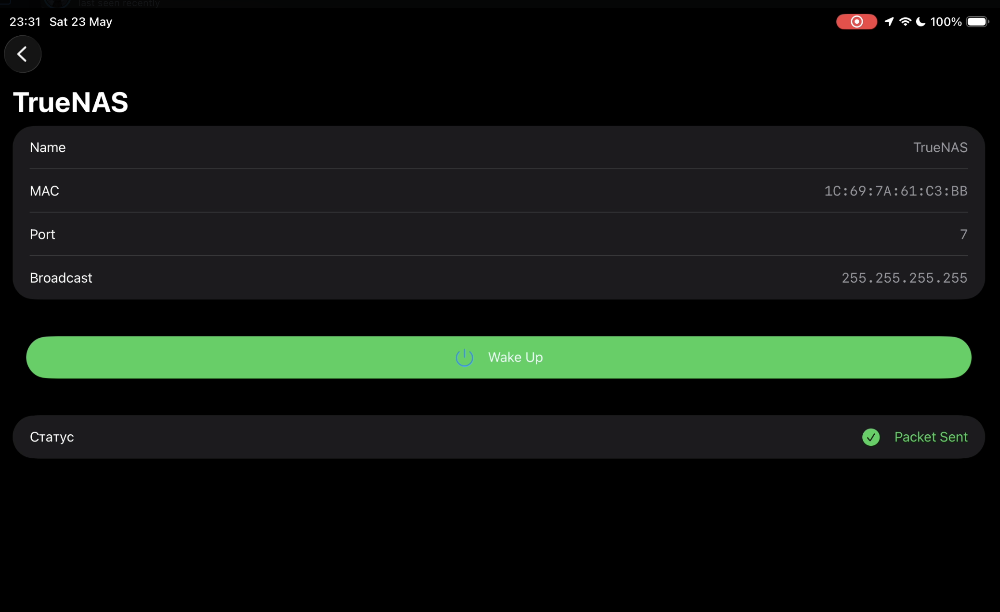

# WakeOnLAN

A small SwiftUI app to discover devices on the local network and send Wake-on-LAN (WOL) packets.

## Overview

WakeOnLAN is a lightweight macOS/iOS SwiftUI project that helps you maintain a list of network devices and remotely wake them using Wake-on-LAN magic packets. It includes device discovery, a simple device store, and a sender component to dispatch WOL packets.

## Features

- Discover devices on the local network
- Save and manage devices in a local store
- Send Wake-on-LAN (magic) packets
- Localized UI (English, Russian, Ukrainian)

## Requirements

- Xcode (latest recommended)
- Swift 5.x
- macOS or iOS target supported by SwiftUI

## Getting Started

1. Open the project in Xcode by opening `Wlan.xcodeproj` or the workspace.
2. Build and run the `WakeOnLAN` app target on the simulator or a device.
3. Use the UI to add a device (name, MAC address, broadcast address), save it, and tap a device to send a Wake-on-LAN packet.

## Important Files

- [Wlan/WakeOnLANApp.swift](Wlan/WakeOnLANApp.swift#L1) — App entry point
- [Wlan/WakeOnLANSender.swift](Wlan/WakeOnLANSender.swift#L1) — Sends magic packets
- [Wlan/DeviceStore.swift](Wlan/DeviceStore.swift#L1) — Persistence for devices
- [NetworkMonitor.swift](NetworkMonitor.swift#L1) — Network monitoring utilities

## Localization

This project contains localized strings for English, Russian, and Ukrainian in the `*.lproj` folders.

## Contributing

Contributions are welcome. Open an issue or submit a pull request with a clear description of your change.

## License

Specify a license for the project (e.g., MIT) or add a `LICENSE` file to the repository.

---

## Screenshots

